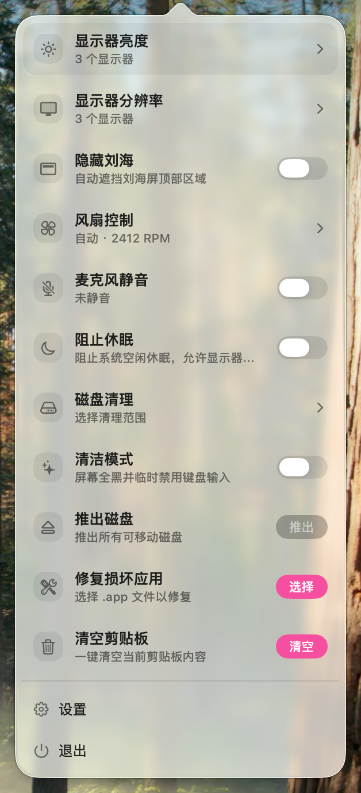
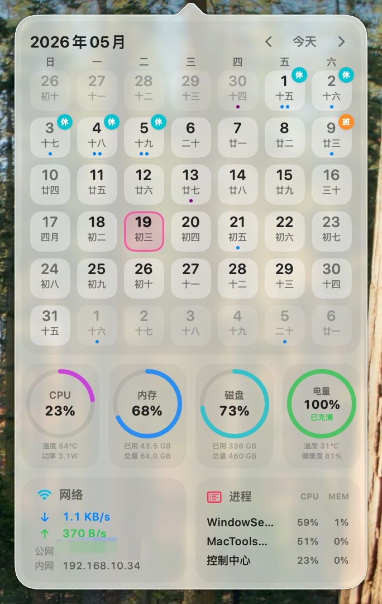

<div align="center">
  
  <h1>A free and open-source collection of native macOS menu bar tools</h1>
  <p><a href="README.zh-CN.md">[中文]</a> [English]</p>

  <p>
    <a href="https://github.com/ggbond268/MacTools/stargazers"></a>
    <a href="https://github.com/ggbond268/MacTools/blob/main/LICENSE"></a>
    <a href="https://github.com/ggbond268/MacTools/releases"></a>
  </p>

  <p>MacTools brings frequently used system actions together in a lightweight, fast, and unobtrusive menu bar app. Built with SwiftUI + AppKit for macOS 14.0 and later.</p>
</div>

## Screenshots

|                                  Menu panel                                   |                                            Component dashboard                                            |
| :---------------------------------------------------------------------------: | :-------------------------------------------------------------------------------------------------------: |
|  |  |

## Features

| Feature | Description |
| ------- | ----------- |
| Display Resolution | View connected displays and switch each display to an available resolution. |
| Display Brightness | Quickly adjust built-in and DDC/CI external display brightness, with per-display shortcut increments and Gamma/Shade fallbacks. |
| True Tone | Automatically adapt display colors to ambient light on MacBooks and compatible displays. |
| Display Sleep | Put all displays to sleep immediately, then wake them with mouse movement or keyboard input. |
| Dark Mode | Toggle the system light and dark appearances, with live state sync when the system theme changes. |
| Night Shift | Toggle Night Shift to reduce blue light and warm the screen colors at night. |
| Prevent Sleep | Keep the system awake while idle, with automatic stop options after 30 minutes, 1 hour, 2 hours, or 5 hours. |
| Clean Mode | Show a full-screen black overlay and temporarily disable input for cleaning the screen, keyboard, or trackpad. |
| Middle Click | Trigger middle click with a three-finger trackpad tap by converting system events through a CGEvent tap, without affecting other gestures or left click. |
| Hide Notch | Mask the top notch area on built-in notch displays without modifying the original wallpaper. |
| Hide Menu Bar Icons | Hide icons to the left of a menu bar divider, with drag-based layout for visible, hidden, and always-hidden areas. |
| Auto Hide Menu Bar | Automatically hide the menu bar to make more screen space available. |
| Auto Hide Dock | Automatically hide the Dock for a cleaner desktop. |
| Stage Manager | Toggle Stage Manager to focus the current window and place other windows on the side. |
| System Mute | Mute or restore system audio output through CoreAudio on the default output device, with automatic restoration when the plugin is disabled. |
| Microphone Mute | Mute or restore the default microphone input through CoreAudio without requesting recording permission. |
| Disk Cleanup | Scan caches, developer caches, and browser caches, with path safety checks and sensitive data protection before deletion. |
| Xcode Cleanup | Scan DerivedData, device support files, archives, simulators, and preview caches by category; deletion is disabled while Xcode is running and only runs inside allowlisted roots. |
| Eject Disks | Eject all removable disks in one click, automatically skipping system volumes and reporting when no disk can be ejected. |
| Empty Trash | Show the number of Trash items and empty Trash through Finder; the action is disabled when Trash is empty. |
| Clear Clipboard | Clear the current clipboard content to protect privacy and avoid accidental paste. |
| IP Check | View public IPv4/IPv6, local LAN IP, location, ISP, ASN, and timezone, with copy support for single fields or the full result. |
| Translator | Translate the currently selected text with a global shortcut; the first version supports OpenAI-compatible services and automatic language selection. |
| App Shortcuts | Bind global shortcuts to common apps; pressing a shortcut opens or activates the app, and hides it if it is already frontmost. |
| Launchpad | Summon an app grid in fullscreen or a compact window, with instant search, horizontal paging, keyboard navigation, drag-to-stack folders with inline rename (click an open folder's title, or right-click a folder to rename/dissolve), an adjustable glass background (clear/standard/deep presets or a custom material + dimming, with a live preview in settings), adjustable appearance (icon size 48–96 pt with rows/columns adapting, optional icons-only mode that hides app names, and a compact-window size slider — the compact panel now scales with large screens instead of capping at 960×680), a global shortcut, and IME-composition safety. |
| Lock Screen | Lock the screen immediately, equivalent to Cmd+Ctrl+Q. |
| Launch Items | Browse LaunchAgent/LaunchDaemon entries with search, field explanations, and user-level enable/disable controls. |
| Calendar Widget | View a monthly calendar, lunar calendar data, holidays, and today's events in the component panel. |
| System Status | Show CPU, memory, disk, battery, network throughput, and high-usage processes. |
| Activity Stats | Track keyboard, mouse, scroll, and foreground app usage, with manual hooks for Claude Code, Cursor, and Codex activity. |
| Device Battery | Aggregate battery levels for the Mac, Bluetooth peripherals, AirPods/Beats split batteries and charging state, and Rapoo VT series mice, with multiple widget layouts. |
| Fan Control | Manage fan speed presets with automatic, full-speed, and custom fixed-RPM modes; installs the bundled helper and requests administrator authorization on first control. |
| Battery Charge Limit | Limit battery charging to a chosen cap, defaulting to 80%; charging stops at the cap and does not automatically resume below it unless the user chooses to continue or force discharge. |
| Fix Damaged Apps | Remove quarantine attributes to resolve "damaged and can't be opened" prompts by selecting a .app in a file panel and running the fix with administrator privileges. |
| Quit Apps | Select and quit running apps, or quit all at once; reverse selection helps quickly choose the target set. |
| zsh Config | View and edit zsh configuration files such as .zshrc and .zshenv inside the app, with syntax highlighting, common snippets, and automatic backup before saving. |
| Plugins & Settings | Install, update, and batch-update plugins in the plugin marketplace, and manage permissions, shortcuts, and plugin-specific settings. |
| Menu Bar Icon Customization | Use local images or lightweight GIF/MP4 animations as the menu bar icon, download animated icons from the online gallery, remove backgrounds, adjust playback speed, and restore the default icon. |
| Localization | Follow the system language by default, or choose a fixed app language in Settings > General > Appearance. |

## Install

```bash
brew install --cask mactools
```

## Upgrade

```bash
brew update
brew upgrade --cask --greedy mactools
```

If Homebrew still reports that the cask is already up to date, check the locally resolved cask version first:

```bash
brew info --cask mactools
```

## Contributing

See [CONTRIBUTING.md](CONTRIBUTING.md) for development setup, testing, plugin development, and release workflows.

## License

MacTools is open source under the [Apache License 2.0](LICENSE).

## Acknowledgements

- Third-party assets, dependencies, and implementation references are listed in [Sources/Resources/ThirdPartyNotices](Sources/Resources/ThirdPartyNotices).
- Contributors

  <a href="https://github.com/ggbond268/MacTools/graphs/contributors">
    
  </a>
