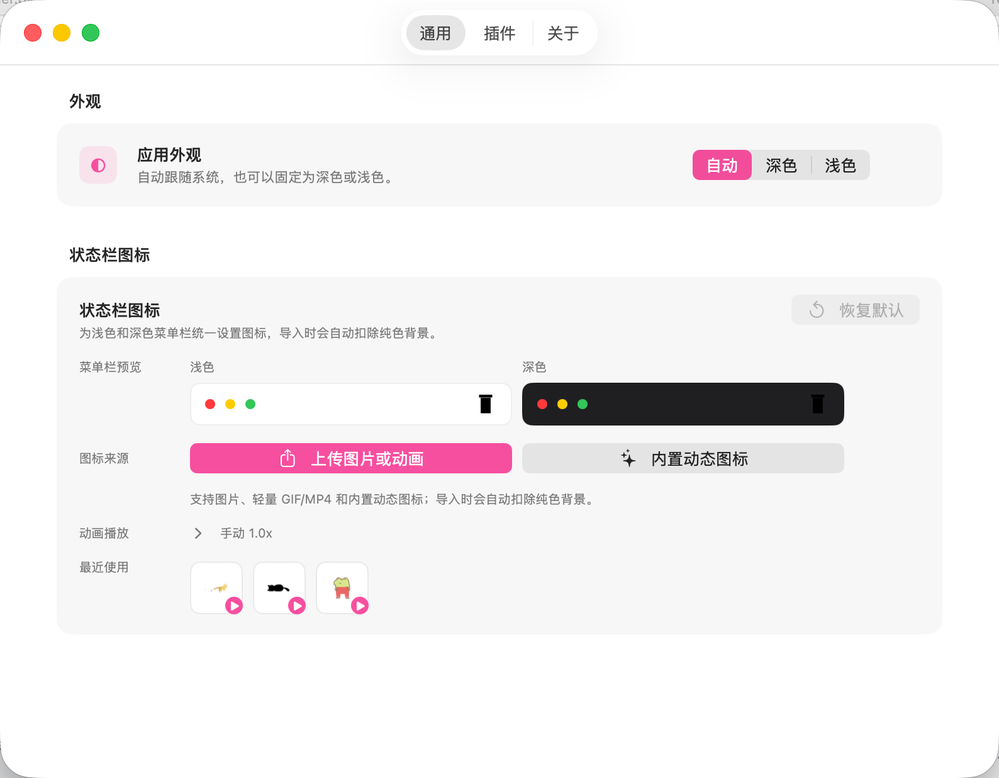
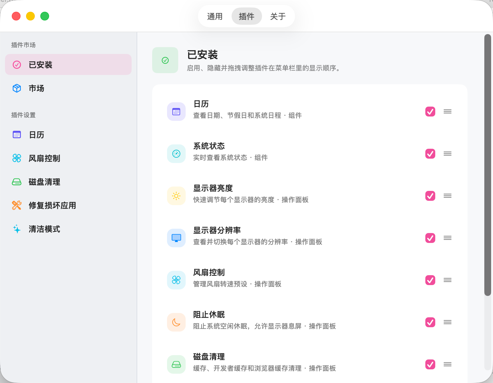

<div align="center">
  
  <h1>MacTools</h1>
  <p><strong>免费、开源的原生 macOS 菜单栏工具集合。</strong></p>
  <p>聚合高频系统能力，保持轻量、快速、低打扰。使用 SwiftUI + AppKit 构建，支持 macOS 14.0 及以上版本。</p>
</div>

## 截图

|                                   菜单栏功能面板                                    |                                              组件仪表盘                                              |                                        通用设置                                         |                                      插件页面                                       |
| :---------------------------------------------------------------------------------: | :--------------------------------------------------------------------------------------------------: | :-------------------------------------------------------------------------------------: | :---------------------------------------------------------------------------------: |
|  |  |  |  |

## 功能

| 功能             | 说明                                                                                                                      |
| ---------------- | ------------------------------------------------------------------------------------------------------------------------- |
| 显示器分辨率     | 查看已连接显示器，并按显示器切换可用分辨率。                                                                              |
| 显示器亮度       | 快速调节内建屏、DDC/CI 外接屏亮度，并提供 Gamma/Shade 回退。                                                              |
| 原彩显示         | 自动调节显示器颜色以适应环境光，支持 MacBook 和兼容显示器。                                                               |
| 显示器休眠       | 一键让所有显示器立即进入休眠，移动鼠标或按键可唤醒。                                                                      |
| 深色模式         | 一键切换系统亮色与深色外观，并实时跟随系统主题变化同步状态。                                                              |
| 夜览             | 一键开关 Night Shift，降低屏幕蓝光，使颜色偏暖，保护夜间视力。                                                            |
| 阻止休眠         | 保持系统空闲时唤醒，支持 30 分钟、1 小时、2 小时、5 小时后自动停止。                                                      |
| 清洁模式         | 全屏黑色覆盖并临时禁用输入，适合清洁屏幕、键盘或触控板。                                                                  |
| 模拟鼠标中键     | 三指轻点触控板触发鼠标中键，通过 CGEvent tap 原地转换系统事件，不影响其他手势与左键操作。                                 |
| 隐藏刘海         | 自动遮挡内建刘海屏顶部区域，不修改用户原始壁纸。                                                                          |
| 自动隐藏菜单栏   | 自动隐藏菜单栏，提供更完整的屏幕显示空间。                                                                                |
| 自动隐藏程序坞   | 自动隐藏程序坞，提供更干净的桌面环境。                                                                                    |
| 台前调度         | 开启台前调度，集中显示当前窗口并把其他窗口收纳到侧边。                                                                    |
| 系统静音         | 一键静音或恢复系统音频输出，通过 CoreAudio 直接控制默认输出设备，停用插件时自动恢复。                                     |
| 麦克风静音       | 一键静音或恢复默认麦克风输入，通过 CoreAudio 直接控制输入设备，无需录音权限。                                             |
| 磁盘清理         | 扫描缓存、开发者缓存与浏览器缓存，执行前进行路径安全和敏感数据保护校验。                                                  |
| Xcode 清理       | 分类扫描 DerivedData、设备支持、归档、模拟器与预览缓存，Xcode 运行时自动禁用，仅在白名单根目录下执行删除。                |
| 推出磁盘         | 一键推出所有可移动磁盘，自动过滤系统卷并在无可推出磁盘时给出状态提示。                                                    |
| 清空废纸篓       | 显示废纸篓项目数，一键通过 Finder 清空，废纸篓为空时自动禁用按钮。                                                        |
| 清空剪贴板       | 一键清空当前剪贴板内容，保护隐私，防止误粘贴。                                                                            |
| 应用快捷键       | 为常用应用绑定全局快捷键，按下即可打开或将应用切换到前台；若应用已在前台则隐藏。                                          |
| 锁定屏幕         | 一键立即锁定屏幕，进入密码解锁界面，等同于 Cmd+Ctrl+Q 快捷键。                                                            |
| 启动项管理       | 可视化查看 LaunchAgent/LaunchDaemon，支持搜索筛选、字段解释和用户级启动项启停管理。                                       |
| 日历组件         | 在组件面板中查看月历、农历、节假日与当天日程。                                                                            |
| 系统状态         | 展示 CPU、内存、磁盘、电量、网络速率与高占用进程。                                                                        |
| 活动统计         | 统计键盘、鼠标、滚动、前台应用使用时长，并可通过手动 Hook 记录 Claude Code、Cursor、Codex 活动。                          |
| 风扇控制         | 通过预设管理风扇转速，支持自动、全速与自定义固定转速，实时显示当前转速；首次控制时会安装内置组件并请求管理员授权。        |
| 电池充电上限     | 限制电池充电至指定上限（默认 80%），达到上限后停止充电；电量低于上限时不自动恢复，由用户决定何时继续充电或强制放电。      |
| 修复损坏应用     | 移除应用隔离属性，解决「已损坏，无法打开」提示，通过文件面板选择 .app 并以管理员权限执行修复。                            |
| 退出应用         | 选择并退出正在运行的应用，或一键退出全部；支持反选，方便快速圈定目标。                                                    |
| zsh 配置         | 在应用内直接查看和编辑 zsh 配置文件（.zshrc、.zshenv 等），支持语法高亮、常用片段快速插入和保存前自动备份。               |
| 插件与设置       | 在插件市场中安装、更新和批量更新插件，并在各插件设置页维护权限、快捷键和专属设置。                                        |
| 状态栏图标自定义 | 上传本地图片或轻量 GIF/MP4 动画作为菜单栏图标，也可从在线图库按需下载动态图标，并支持自动扣背景、播放速度调整和恢复默认。 |

## 特性

- 菜单栏常驻，默认不进入 Dock，适合后台长期运行。
- 插件化架构，菜单功能与组件面板可按需启用、隐藏和排序。
- 原生 macOS 视觉与交互，主面板、详情面板、设置页体验一致。
- 对权限、显示器、文件路径和系统 API 调用保留失败分支与降级路径。

## 安装

```bash
brew tap ggbond268/mactools
brew install --cask mactools
```

## 升级

Homebrew 升级前需要先刷新 tap，确保本地拿到最新的 cask 配方：

```bash
brew update
brew upgrade --cask --greedy ggbond268/mactools/mactools
```

如果仍提示已经是最新版本，可以先查看本地识别到的 cask 版本：

```bash
brew info --cask ggbond268/mactools/mactools
```

## 开发

核心 app 代码在 `Sources/`，插件源码在 `Plugins/<PluginName>/`。每个插件目录包含 `plugin.json`、`Sources/`、`Bundle/`，有测试时放在同目录的 `Tests/`。普通插件不需要手动修改根 `project.yml`；`make generate`、`make build`、`make run` 和 `make build-plugin` 会自动扫描插件并生成 XcodeGen 配置。需要额外 framework、include path 或 bundle 资源的插件，可在自己的 `Plugins/<PluginName>/project.yml` 中只声明差异项。

```bash
make setup      # 生成 LocalConfig.xcconfig，请填写 DEVELOPMENT_TEAM 与 BUNDLE_IDENTIFIER_PREFIX
make generate   # 使用 XcodeGen 生成 MacTools.xcodeproj
make build      # 编译校验
make run        # 本地运行，并同步最新 Debug 插件到本地开发市场
```

开发或调试本地插件：

```bash
make run                          # 增量编译 App 和插件，同步 Debug 插件包并启动
make sync-debug-plugins           # 只同步已编译的 Debug 插件包和 catalog，不启动 App
make build-plugin                 # 单独构建插件包，用于验证动态包/发布链路
make build-plugin PLUGIN=calendar # 只单独构建指定插件目录名或插件 ID
```

快速发包：

```bash
make release # 交互选择 app 或 plugin，先分析并预览 bump，确认后再 pull、检查、bump、提交、打 tag 并 push
```

App 发布会更新 `project.yml` 并推送 `v*.*.*` tag；插件发布会按生产 catalog 分析需要发布的插件，必要时更新对应 `plugin.json.version`，再推送 `plugins-*` 批次 tag。后续签名、公证、上传 Release 和更新 appcast/catalog 仍由 GitHub Actions 完成。

GitHub 页面发包请使用 `Actions` → `Prepare Release`，输入发布类型、目标版本和是否继续 release；不要从 GitHub `Releases` 页面直接创建新 tag。

插件发布通过 `plugins-*` 批次 tag 触发 GitHub Actions。只需要给实际变更的插件递增 `plugin.json.version`；工作流会默认只构建和上传变更插件，合并签名后的 catalog，并保留未变化插件的既有下载链接。

新增和更新插件的简短流程见 [docs/plugins/local-native-plugins.md](docs/plugins/local-native-plugins.md#development-steps)。

运行完整测试：

```bash
xcodebuild -project MacTools.xcodeproj -scheme MacTools -configuration Debug -derivedDataPath build/DerivedData test -quiet
```

贡献、测试和发布流程请参考 [CONTRIBUTING.md](CONTRIBUTING.md)。
GitHub Actions 自动构建与发布配置请参考 [docs/github-actions.md](docs/github-actions.md)。
插件 catalog、包结构和批次发布流程请参考 [docs/plugins/plugin-catalog.md](docs/plugins/plugin-catalog.md)。

## 许可证

MacTools 基于 [Apache License 2.0](LICENSE) 开源。

## 致谢

- 第三方素材、依赖与实现参考见 [Sources/Resources/ThirdPartyNotices](Sources/Resources/ThirdPartyNotices)。
- 贡献者

  <a href="https://github.com/ggbond268/MacTools/graphs/contributors">
    
  </a>
